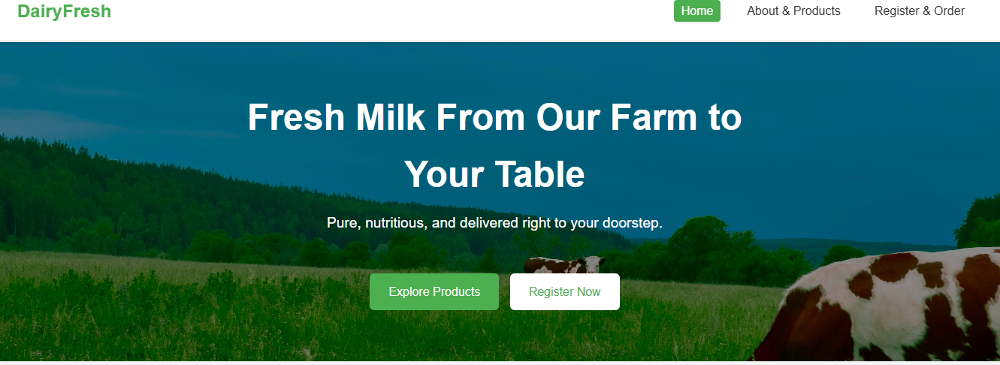
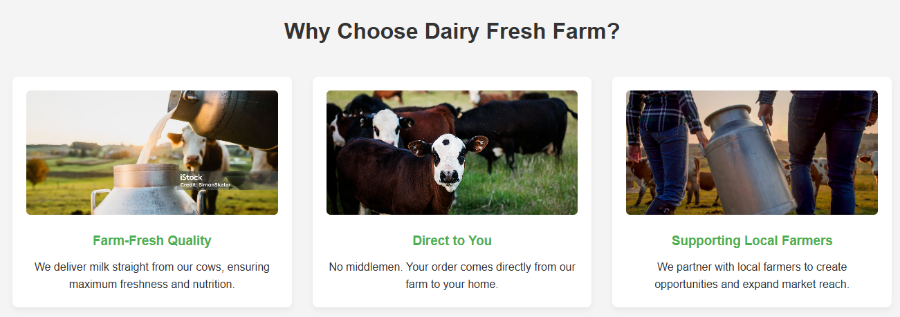
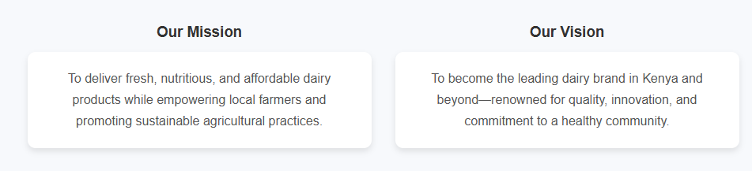
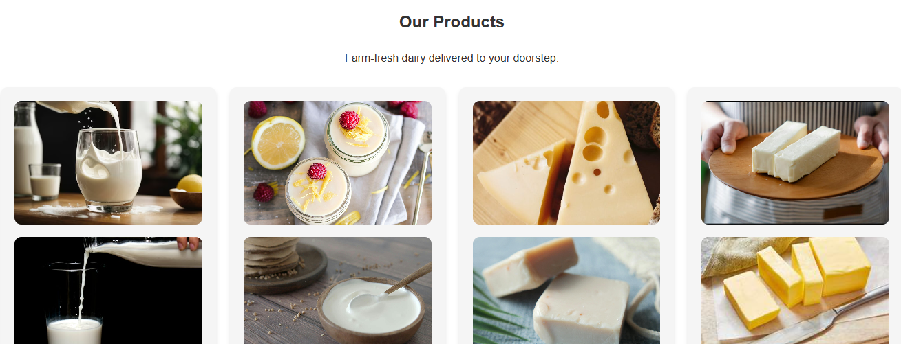
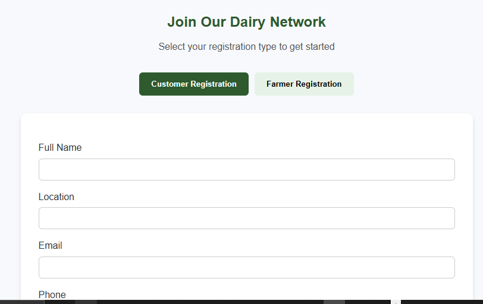

# Dairy Fresh Farm Website

A responsive multi-page website for **FreshDairy Farm**, built with **HTML, CSS, and JavaScript**.  
The site markets farm products, enables customer ordering, and allows farmers to register as milk suppliers.

---

## 🌐 Live Demo
[https://dairyfresh.netlify.app/](https://dairyfresh.netlify.app/)

---

## 📁 Project Structure


```text
├── index.html              # Home page
├── about_products.html     # About Us + Products page
├── register.html           # Customer & Farmer registration
├── css/
│   └── style.css           # Global styles (responsive)
├── js/
│   └── main.js 
|   |___ register.js        # Mobile nav toggle & small interactions
└── images/                 # Site images (cows, products, etc.)
```


---

## ✨ Features
- **Responsive Design**  
  - Mobile-friendly navigation with a hamburger menu toggle.  
  - Layouts adjust seamlessly across phones, tablets, and desktops.

- **Customer Registration**  
  - Form for name, contact details, location, and product selection using checkbox multi-select.

- **Farmer Registration**  
  - Farmers input milk delivery capacity and price per liter.

- **Products Showcase**  
  - Displays fresh dairy products and the farm’s cows.

- **Mission & Vision**  
  - Highlights the farm’s story and long-term goals.

- **Subscription Form**  
  - Users can subscribe for updates and offers.

---

## 🚀 Deployment
Deployed using **Netlify** with **GitHub Continuous Deployment**:  
Push changes to the GitHub repository → Netlify automatically rebuilds and updates the live site.

---

## 💻 Technologies
- **HTML5** – page structure and content  
- **CSS3** – styling, Flexbox layout, media queries for responsiveness  
- **JavaScript (ES6)** – navigation toggle and interactivity  
- **Netlify** – hosting and automatic deployment

---

## 🔧 Local Development
To run the project locally:
1. Clone the repository:
   ```bash
   git clone https://github.com/Felo10coder/plp-webtechnologies-classroom-july2025-july-2025-final-project-and-deployment-Final-Project-and-Depl.git

2. Open a Terminal / Command Prompt

   Navigate to the location where you cloned the repo:
      Example:
         cd plp-webtechnologies-classroom-july2025-july-2025-final-project-and-deployment-Final-Project-and-Depl


3. Open index.html directly in a browser, or use a live server extension in VS Code.

4. Open the Site Locally

You have two options:

👉 Option A: Open directly in a browser

      On Windows:

         start index.html


      On macOS:

        open index.html


      On Linux:

         xdg-open index.html


      This will launch your default browser with the homepage.

👉 Option B: Use VS Code Live Server (recommended)

      Open VS Code:

         code .


      Install the Live Server extension (if not already installed).

Right-click on index.html → Open with Live Server.
VS Code will start a local server (e.g., http://127.0.0.1:5500/
) and automatically refresh when you edit files.
---
----

# <u> Screenshots </u>

# <center>🏠 Homepage </center>




# <center>About&Products Page</center>



# <center>📄 Registration Page</center>


